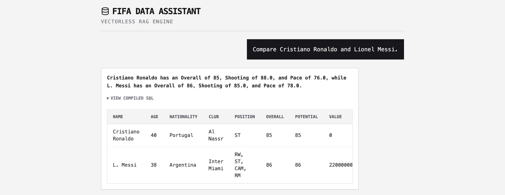
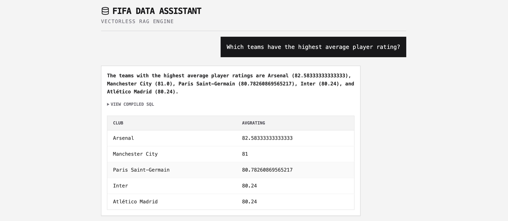
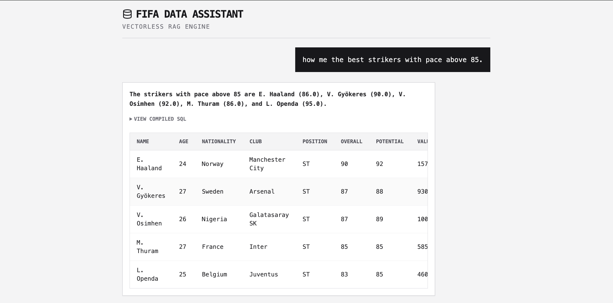
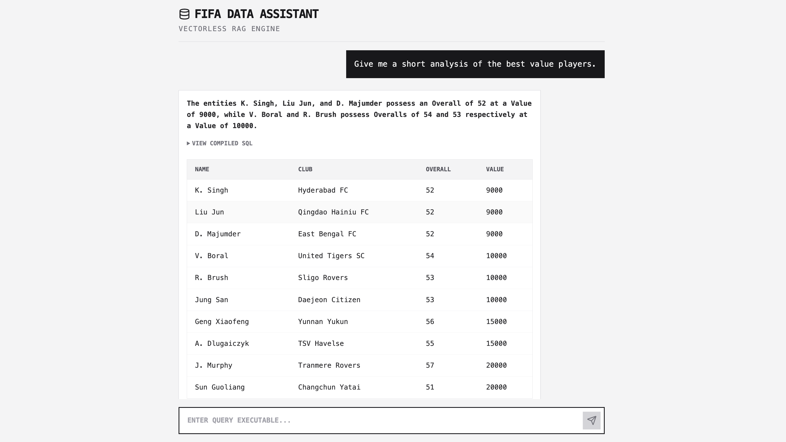

# ⚽ FIFA Agentic Data Assistant

A decoupled, deterministic Text-to-SQL AI application built to query, analyze, and summarize the EA FC 26 player dataset.

## 🏗️ Architecture & Stack
* **Frontend:** React (Vite) + Tailwind CSS (Monospace/Brutalist design)
* **Backend API:** FastAPI (Python)
* **Database:** SQLite (Populated via Pandas/Kaggle FC26 Dataset)
* **LLM Engine:** Gemini 3.1 Flash-Lite (Agentic Text-to-SQL routing)

## ✅ Assignment Requirements Fulfilled

**1. Data Input**
* Ingested the EA Sports FC 26 Complete Player Dataset (18,000+ rows).
* Cleaned and migrated the CSV into a lightweight, queryable SQLite database.

**2. User Query Interface**
* Built a custom React web application with a conversational chat interface.
* Features real-time loading states, error boundaries, and dynamic data grid rendering.

**3. Structured Output**
* **Two-Step AI Pipeline:** The engine first compiles raw data into a responsive grid, then runs a secondary LLM pass (temperature = 0.0) to generate a concise, human-readable text summary of the exact metrics.
* Includes an expandable "View Compiled SQL" debug panel for transparency.

**4. Complex Logic & Filtering**
* **Top N Ranking:** Handled via programmatic rules injecting `ORDER BY` and `LIMIT` clauses.
* **Player Comparisons:** Handled via complex `UNION ALL` subqueries to prevent duplicate sibling matches (e.g., separating Jude vs. Jobe Bellingham).
* **Team-Level Aggregation:** Supports advanced SQL grouping (e.g., `AVG(Overall) GROUP BY Club`).

**5. Enterprise Error Handling & Guardrails**
* **Hallucination Resistance:** Implemented a Python interceptor (`_sanitize_like_literals`) to strip accented characters via regex before database execution, preventing zero-match errors.
* **Out-of-Bounds Queries:** Queries unrelated to football are trapped and return a strict `INVALID_QUERY` refusal.
* **Data Serialization:** Built-in safeguards to catch and replace `NaN` values to ensure JSON-compliant API responses.
* **Missing Entities:** Graceful textual fallbacks when a requested player is not in the current roster.

## 🚀 How to Run Locally

1. **Backend:**
   ```bash
   pip install -r requirements.txt
   uvicorn api:app --reload

### 📊 The Interface

**Direct Player Comparison & SQL Compilation:**


**Average Player Rating:**


**Best Striker with pace above 85:**


**Error Handling and Guard Rails:**


**Short Analysis of the best value player**
